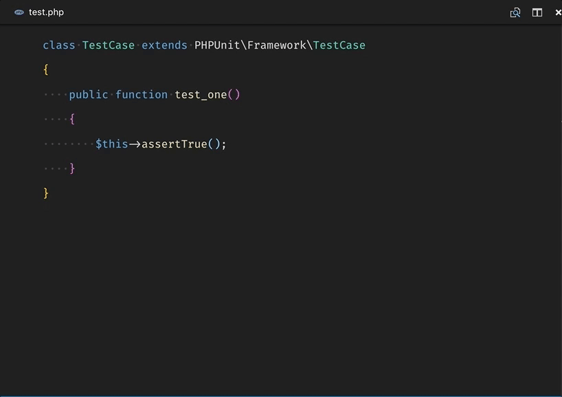

# Better PHPUnit

Better PHPUnit is the most popular, cleanest, and fastest PHPUnit runner for VS Code.



## Run a test method:
- Place your cursor in/on the method you want to run
- Open the command menu: `cmd+shift+p`
- Select: `Better PHPUnit: run`

## Run a test file:
- Open the command menu: `cmd+shift+p`
- Select: `Better PHPUnit: run-file`

## Run the entire suite:
- Open the command menu: `cmd+shift+p`
- Select: `Better PHPUnit: run suite`

## Run the previous test:
- Open the command menu: `cmd+shift+p`
- Select: `Better PHPUnit: run previous`

## Features:
- Color output!
- Run individual methods by placing your cursor anywhere in/on the method
- Test failures are displayed in the "Problems" panel for quick access

> Note: this plugin registers "tasks" to run phpunit, not a command like other extensions. This makes it possible to leverage the problem output and color terminal.

Keybindings:
```
{
    "key": "cmd+k cmd+r",
    "command": "better-phpunit.run"
},
{
    "key": "cmd+k cmd+f",
    "command": "better-phpunit.run-file"
},
{
    "key": "cmd+k cmd+p",
    "command": "better-phpunit.run-previous"
}
```

Config:
```
{
    "better-phpunit.commandSuffix": null, // This string will be appended to the phpunit command, it's a great place to add flags like '--stop-on-failure'
    "better-phpunit.phpunitBinary": null // A custom phpunit binary. Ex: 'phpunit', '/usr/local/bin/phpunit'
    "better-phpunit.suiteSuffix": null // Specify options to appended only to the 'run suite' command, for example add options like '--testsuite unit' or '--coverage --coverage-xml'.
}
```

Running tests over ssh (For VMs like Laravel Homestead):
```
{
    "better-phpunit.ssh.enable": true,
    "better-phpunit.ssh.paths": {
        "/your/local/path": "/your/remote/path"
    },
    "better-phpunit.ssh.user": "user",
    "better-phpunit.ssh.host": "host",
    "better-phpunit.ssh.port": "22"
    "better-phpunit.ssh.binary": "putty -ssh"
}
```

Running tests in already running Docker containers:
```
{
    "better-phpunit.docker.enable": true,
    "better-phpunit.docker.command": "docker exec container-name",
    "better-phpunit.docker.paths": {
        "/your/local/path": "/your/remote/path"
    },
}
```

Running tests with Docker Compose, starting up a service and removing the container when finished:
```
{
    "better-phpunit.docker.enable": true,
    "better-phpunit.docker.command": "docker-compose run --rm service-name",
    "better-phpunit.docker.paths": {
        "/your/local/path": "/your/remote/path"
    },
}
```

**Note:**
For running Docker over a SSH session just use both options _ssh.enable_ and _docker.enable_ combined.

## Wish List:
- Handling PHP fatal and parser errors
- A sidebar panel for managing errors
- Re-run failures
